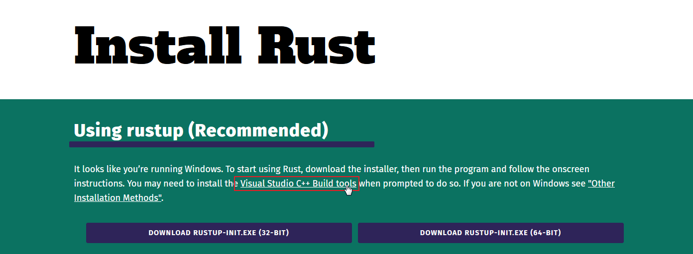
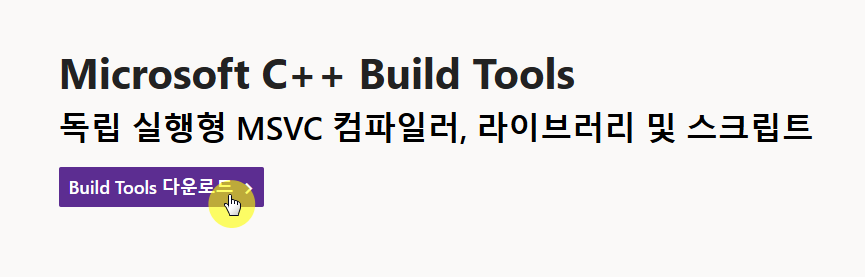
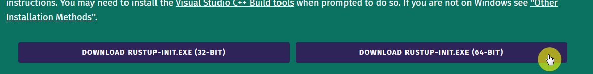
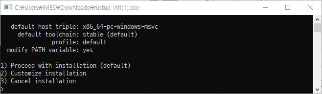
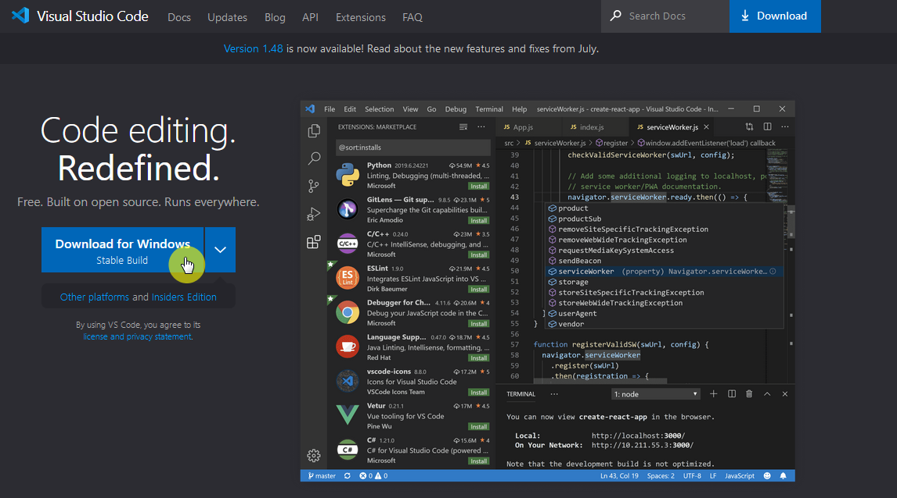
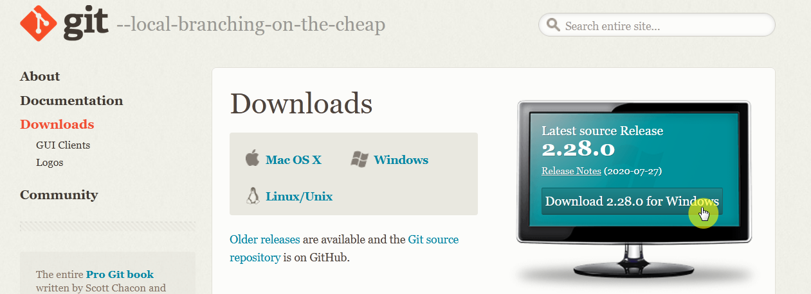
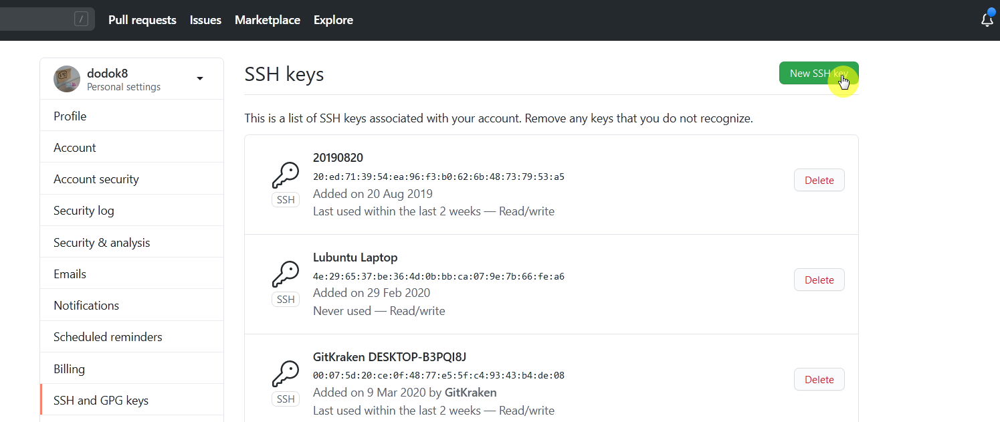
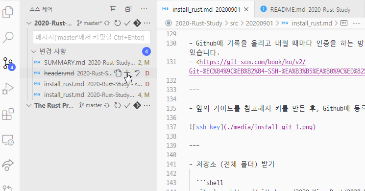
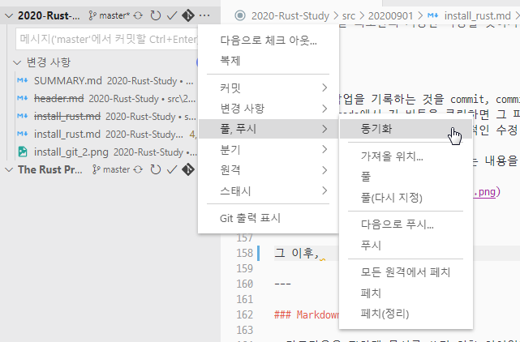

# 러스트 설치하기

2020년 9월 1일
김현서

---

## Rust 

Rust를 설치하는 방법은 여러 방법이 있지만, rustup이라는 도구를 통해서 rust와 그와 관련된 도구를 설치할 수 있습니다. 설치는 윈도우 기준입니다.

---

### 1. Rust-lang install 접속

- <https://www.rust-lang.org/tools/install> 접속
- Visual Studio C++ Build Tools 링크 클릭


---

### 2. Visual Studio C++ Build Tools 설치

- 링크 클릭 : `vs_BuildTools.exe`  다운로드 후 실행
- 이후 Visual Studio Build Tools 2019를 기본 옵션으로 설치


---

### 3. RUSTUP-INIT.EXE 실행

- <https://www.rust-lang.org/tools/install>로 들어와서 **64비트** 다운로드 후 실행

- 이후 default 옵션으로 설치하기 위해 1을 입력 후 실행


---

### 5. 설치 확인

- 설치 확인을 위해서 터미널(CMD, Bash, PowerShell이든 뭐든)에서 다음 명령어를 입력합니다.

  ```shell
  rustc --version
  ```

  다음과 같은 형식으로 출력되면 성공한 것입니다.
  
  ```text
  rustc x.y.z. (abcabcabcc yyyy-mm-dd)
  ```

---

## 텍스트 에디터 Visual Studio Code 설치 및 세팅

- Rust를 메모장에서 공부할 수도 있고, 이 책을 따라가는 데 큰 불편함이 없을 수도 있겠지만, 그래도 편한 도구를 사용해 봅시다. Visual Studio Code는 여러 막강한 기능을 제공하는 에디터이지만 그건 스스로 찾아 보시고 여기서는 rust와 관련된 기능만 사용할 것입니다.

---

### 1. Visual Studio Code 설치

- <https://code.visualstudio.com/> 접속, 파일 설치 및 실행

  

---

### 2. Rust 확장 기능 설치

- <https://marketplace.visualstudio.com/items?itemName=rust-lang.rust>에 들어가 install 누르기
- 그러면 VSC에서도 그 확장 기능 창이 뜰 텐데 설치하면 됩니다.


---

### 3. 설정 지정

- 대부분의 설정은 GUI로 설정할 수 있는데, 몇몇 설정은 직접 파일을 수정하긴 해야합니다.
- 그 파일을 접속하긴 위해선 윈도우 탐색기에서 `%appdata%/Code/User`에 들어가면 `settings.json`에 들어가서 편집해야합니다.

---

- 그래서 파일을 미리 작성해서 여기 적어놓았습니다.

  ```json
  {
    "[rust]": {
      "editor.defaultFormatter": "rust-lang.rust",
      "editor.tabSize": 4
    },
    "editor.insertSpaces": true,
    "rust-analyzer.checkOnSave.overrideCommand": null,
    "rust-analyzer.debug.engine": "vadimcn.vscode-lldb",
    "rust-analyzer.rustfmt.overrideCommand": null,
    "rust.build_lib": false,
    "editor.formatOnPaste": true,
    "editor.formatOnSave": true,
    "editor.formatOnType": true,
  }
  ```

---

## Git

- 가장 폭 넓게 쓰이는 버전관리 시스템입니다. 저희는 Github에서 제공하는 기능과 연계하여 배포용으로만 사용할 예정입니다.

---

### Git 설치

- <https://git-scm.com/downloads> 들어가서 설치해주세요.



- Github에 가입해주세요.

---

### 기본적인 Git 사용법

#### 1.SSH 키 등록

- Github에 기록을 올리고 내릴 때마다 인증을 하는 방법도 있지만 한 번에 진행하는 방법이 있습니다.
- <https://git-scm.com/book/ko/v2/Git-%EC%84%9C%EB%B2%84-SSH-%EA%B3%B5%EA%B0%9C%ED%82%A4-%EB%A7%8C%EB%93%A4%EA%B8%B0>

---

- 앞의 가이드를 참고해서 키를 만든 후, Github에 등록을 해야합니다.


테스트

---

- 저장소 (전체 폴더) 받기

  ```shell
  git clone https://github.com/2020-Wing-Rust/2020-Wing-Rust.github.io.git
  ```
- 저희는 정말 최소한의 기능만 사용할 것이기 때문에, VS Code를 통해서 Git을 관리하도록 하겠습니다.

---

- Git에서 작업을 기록하는 것을 commit, commit할 파일 목록에 올리는 것을 stage라고 합니다. vs code에서 저 버튼을 클릭하면 그 파일을 스테이징 할 수 있습니다.
- 스테이징 시점이 기준이므로, 추가적인 수정 사항도 포함하고 싶다면 다시 stage를 눌러주세요.
- 이후 위의 입력창에 적당히 커밋하는 내용을 요약한 후 Ctrl + Enter를 누르면 됩니다.



---

- 그 이후, 동기화를 눌러주세요. 이 작업은 최신버전으로 업로드(푸쉬)와 다운로드(풀)을 동시에 진행합니다.



---

### Markdown

- 마크다운은 편하게 문서를 쓰기 위한 언어입니다. 현재 사용 중인 플랫폼도 마크다운 파일을 받아들여서 HTML 형식의 전자책으로 만드는 과정을 통해 배포되고 있습니다. 여기서는 직접적으로 문법을 안 다루겠습니다. 굳이 마크다운으로 자료를 만들 필요는 없거든요.
- <https://heropy.blog/2017/09/30/markdown/>