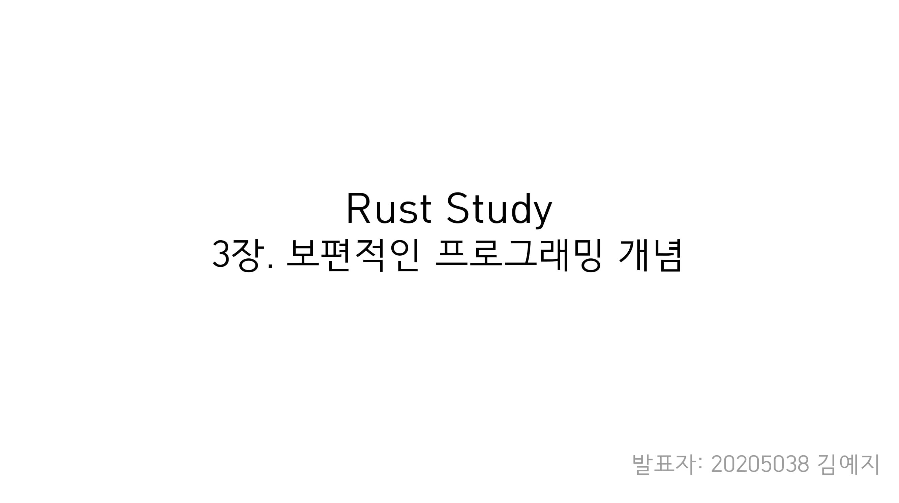
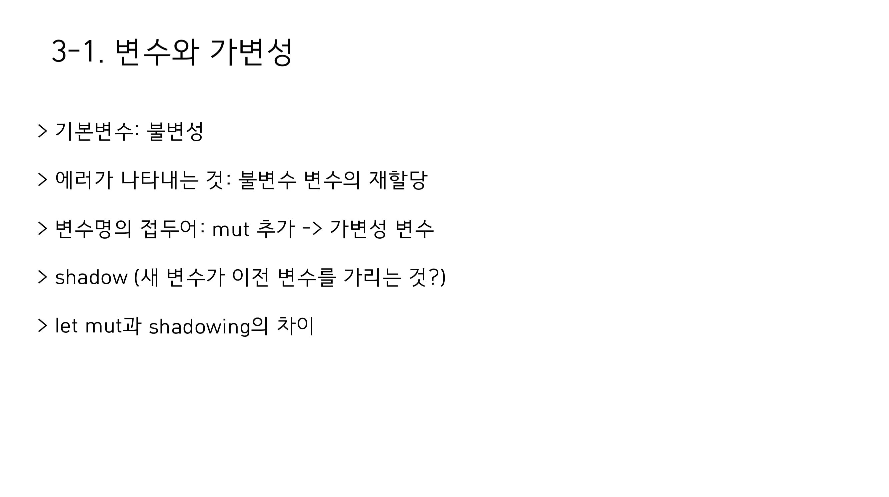
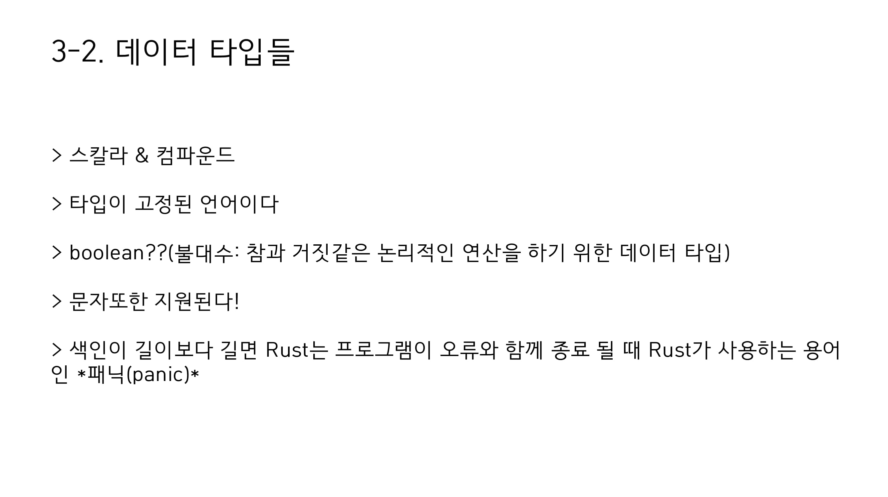
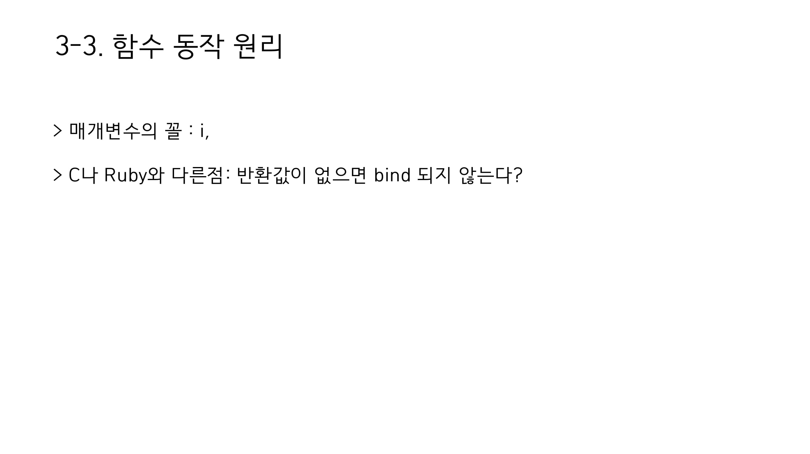

# 보편적 프로그래밍 개념

2020년 9월 15일
김예지

- `error[E0384]: cannot assign twice to immutable variable 'x` : 불변 변수에 할당 시도시 나타나는 에러
- `mut은` 아예 값을 바꾼다면, `shadowing`은 값은 그대로 있으나 새로운 값으로 연결하는 것

- `panic!`은  rust에서 제공하는 매크로 중 하나로, 실패 메세지를 출력하고 스택 메모리를 정리한 후 정지하는 명령어이다.  이 경우 인덱스 값을 넘어선 범위를 접근하려 했기 때문에 `panic!`이 호출된 것이다.
- 타입이 고정되어 있긴 하지만 타입 추론이 강력하여, 변수 선언시 종류를 굳이 선언 안해도 됨.
- `boolean`은 논리 연산(불 대수)를 하기 위한 연산자로, C언어에서는 그냥 0과 1을 사용하고, 대부분의 언어에서는 `boolean`이 아니어도 조건문에 활용할 수 있지만, rust는 boolean을 반환하는 것만 조건문을 통해 받는다.

- 반환 값이 없다는 의미 : 대부분의 언어에서, `=`를 실행하면 대입되는 값을 반환한다. `x = y = 6` 하면 둘 다 6이라는 값이 들어가는 것처럼. 하지만 rust의 경우 `=`는 아무것도 반환하지 않으므로 이렇게 묶을 수 없다.

- 문서화 주석을 제공하긴 하나 이 스터디에서 다루는 내용은 아님.

- 다른 언어도 `if ... else if ... else`로 구성된 블럭이면 마찬가지
- 조건문에는 반드시 `boolean` 리턴 값이 들어가야 한다.
- 더 정교한 처리를 원하면 `match`를 사용하자.

## 반복문

- 루프 자체에서 값을 리턴할 수 있다.
- 특정 조건은 `while`을 통해서 루프 가능하다.
- `loop`문으로 무한 루프를 돌릴 수 있다.
- `for` 문을 통해 iterator를 비롯해 컬렉션들의 각 요소를 반복 시킬 수 있다.

